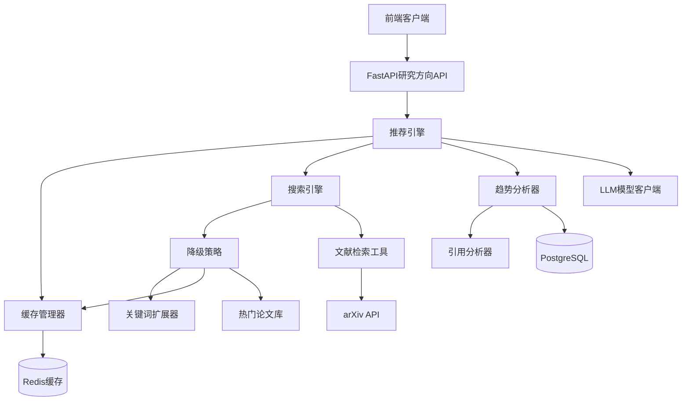

# Design Document: Search and Recommendation Optimization

## Overview

本设计文档描述了AutoScholar系统研究方向推荐模块的优化方案。核心目标是修复当前推荐系统在搜索无结果时直接失败的问题，通过多层降级策略确保系统始终能够提供有价值的推荐结果。

### 设计目标

1. **鲁棒性优先**：确保推荐系统在各种异常情况下都能返回有用结果
2. **性能优化**：通过Redis缓存减少外部API调用，提升响应速度
3. **智能推荐**：基于引用分析和趋势识别提供高质量推荐
4. **渐进增强**：采用分层架构，支持功能逐步扩展

### 技术栈

- **后端框架**: FastAPI (Python 3.11)
- **数据库**: PostgreSQL (持久化存储), Redis (缓存层)
- **AI模型**: 通过model_client调用（Qwen/DeepSeek/OpenAI）
- **外部API**: arXiv API (文献检索)

## Architecture

### 系统架构图



### 分层架构


**1. API层** (backend/app/api/research.py)
- 处理HTTP请求和响应
- 参数验证和错误处理
- 调用推荐引擎

**2. 业务逻辑层**
- 推荐引擎：协调各组件生成推荐
- 搜索引擎：执行文献检索和降级策略
- 趋势分析器：分析研究热度和趋势

**3. 数据访问层**
- 缓存管理器：Redis操作封装
- 数据库访问：PostgreSQL操作
- 外部API调用：arXiv API封装

**4. 支持服务层**
- 关键词扩展器：学术词库和同义词
- 引用分析器：论文引用关系分析
- 用户画像：历史行为追踪

## Components and Interfaces

### 1. 推荐引擎 (RecommendationEngine)

**职责**：协调各组件生成研究方向推荐

**接口**：
```python
class RecommendationEngine:
    async def generate_recommendations(
        self,
        interests: Optional[List[str]] = None,
        user_id: Optional[int] = None,
        limit: int = 5
    ) -> RecommendationResult:
        """
        生成研究方向推荐
        
        Args:
            interests: 用户研究兴趣关键词列表（可选）
                      - 如果提供：使用提供的兴趣关键词
                      - 如果为None且user_id存在：从用户画像自动提取兴趣
                      - 如果都为None：返回通用热门推荐
            user_id: 用户ID（用于个性化推荐和自动提取兴趣）
            limit: 推荐数量
            
        Returns:
            RecommendationResult: 包含推荐内容、论文列表、置信度等
        """
        pass
    
    async def suggest_interests(
        self,
        user_id: int,
        limit: int = 10
    ) -> List[InterestSuggestion]:
        """
        基于用户画像推荐研究兴趣关键词
        
        从用户的搜索历史、阅读记录、反馈行为中提取和推荐兴趣关键词
        
        Args:
            user_id: 用户ID
            limit: 推荐的兴趣关键词数量
            
        Returns:
            List[InterestSuggestion]: 推荐的兴趣关键词列表，按权重排序
        """
        pass
```

**核心逻辑**：
1. **兴趣获取阶段**（三种模式）：
   - **模式1 - 用户主动输入**：用户提供interests参数（初次使用或主动探索新领域）
   - **模式2 - 用户画像辅助**：用户提供部分interests，系统从用户画像补充相关兴趣
   - **模式3 - 纯画像推荐**：用户未提供interests但有user_id，系统从用户画像提取兴趣
   - **模式4 - 通用推荐**：新用户无输入无画像，返回通用热门推荐
2. **论文检索阶段**：调用搜索引擎获取相关论文（带降级策略和跨语言翻译）
3. **评分排序阶段**：如果有足够论文，调用趋势分析器计算评分
4. **个性化调整**：如果有用户画像，根据用户兴趣权重调整推荐排序
5. **推荐生成阶段**：调用LLM生成推荐文本
6. **结果返回阶段**：返回结构化推荐结果

**用户输入与用户画像的关系**：
- **初期使用**：用户手动输入研究兴趣（必需），系统开始建立用户画像
- **持续使用**：用户可继续手动输入，系统同时提供基于画像的兴趣建议
- **成熟阶段**：用户可选择使用画像推荐的兴趣，或继续手动输入探索新领域
- **辅助作用**：用户画像用于推荐排序优化、兴趣建议，但不强制替代用户输入

### 用户画像管理器 (UserProfileManager)

**职责**：管理用户兴趣画像，提供兴趣推荐和提取

**接口**：
```python
class UserProfileManager:
    async def extract_interests(
        self,
        user_id: int,
        limit: int = 10
    ) -> List[InterestKeyword]:
        """
        从用户历史行为中提取研究兴趣关键词
        
        提取策略：
        1. 从搜索历史中提取高频关键词
        2. 从阅读论文中提取主题和分类
        3. 从正向反馈中提取相关主题
        4. 按权重排序，返回top N
        
        Args:
            user_id: 用户ID
            limit: 返回的兴趣关键词数量
            
        Returns:
            List[InterestKeyword]: 兴趣关键词列表，包含关键词和权重
        """
        pass
    
    async def suggest_interests_for_input(
        self,
        user_id: int,
        current_input: str = "",
        limit: int = 10
    ) -> List[InterestSuggestion]:
        """
        为用户输入框提供兴趣关键词建议
        
        用于前端输入框的自动补全和推荐
        
        Args:
            user_id: 用户ID
            current_input: 用户当前输入的文本（用于过滤）
            limit: 建议数量
            
        Returns:
            List[InterestSuggestion]: 建议列表，包含关键词、权重、来源说明
        """
        pass
    
    async def update_interest_from_search(
        self,
        user_id: int,
        query: str
    ) -> None:
        """从搜索行为更新用户兴趣"""
        pass
    
    async def update_interest_from_reading(
        self,
        user_id: int,
        paper_id: str,
        categories: List[str]
    ) -> None:
        """从阅读行为更新用户兴趣"""
        pass
```

**兴趣提取算法**：
```python
# 权重计算公式
interest_weight = (
    search_frequency * 0.4 +      # 搜索频率
    reading_count * 0.3 +          # 阅读次数
    positive_feedback * 0.2 +      # 正向反馈
    recency_factor * 0.1           # 时间衰减因子
)

# 时间衰减：最近30天权重1.0，每30天衰减10%
recency_factor = 0.9 ^ (days_since_last_activity / 30)
```

### 2. 搜索引擎 (SearchEngine)

**职责**：执行文献检索，实现多层降级策略

**接口**：
```python
class SearchEngine:
    async def search_with_fallback(
        self,
        keywords: List[str],
        limit: int = 10
    ) -> SearchResult:
        """
        带降级策略的搜索
        
        Args:
            keywords: 搜索关键词列表
            limit: 结果数量
            
        Returns:
            SearchResult: 包含论文列表、数据源、是否降级等信息
        """
        pass
```

**降级策略流程**：
```python
# 策略1：尝试所有关键词组合搜索
papers = await self._search_all_keywords(keywords)
if len(papers) >= 3:
    return SearchResult(papers=papers, source="primary")

# 策略2：逐个关键词搜索
for keyword in keywords:
    papers = await self._search_single_keyword(keyword)
    if len(papers) >= 3:
        return SearchResult(papers=papers, source="single_keyword")

# 策略3：关键词扩展
expanded_keywords = await self.keyword_expander.expand(keywords)
papers = await self._search_expanded(expanded_keywords)
if len(papers) >= 3:
    return SearchResult(papers=papers, source="expanded")

# 策略4：从缓存获取相似查询结果
papers = await self.cache_manager.get_similar_results(keywords)
if len(papers) >= 3:
    return SearchResult(papers=papers, source="cache_fallback")

# 策略5：返回热门论文
papers = await self._get_trending_papers(keywords)
return SearchResult(papers=papers, source="trending_fallback", is_fallback=True)
```

### 3. 缓存管理器 (CacheManager)

**职责**：管理Redis缓存，提供缓存读写和降级支持

**接口**：
```python
class CacheManager:
    async def get_cached_results(self, cache_key: str) -> Optional[List[Dict]]:
        """获取缓存的搜索结果"""
        pass
    
    async def set_cached_results(
        self, 
        cache_key: str, 
        results: List[Dict],
        ttl: int = 3600
    ) -> bool:
        """存储搜索结果到缓存"""
        pass
    
    async def get_similar_results(
        self, 
        keywords: List[str],
        threshold: float = 0.7
    ) -> List[Dict]:
        """获取相似查询的缓存结果（用于降级）"""
        pass
    
    def generate_cache_key(self, keywords: List[str], filters: Dict = None) -> str:
        """生成缓存键"""
        pass
```

**缓存键设计**：
```python
# 格式：search:{sorted_keywords}:{filter_hash}
# 示例：search:deep_learning,nlp:a3f2b1
```

### 4. 趋势分析器 (TrendAnalyzer)

**职责**：分析研究热度和趋势，计算推荐评分

**接口**：
```python
class TrendAnalyzer:
    async def analyze_papers(
        self, 
        papers: List[Dict]
    ) -> List[PaperScore]:
        """
        分析论文并计算综合评分
        
        评分公式：
        score = citation_impact * 0.4 + trend_score * 0.3 + relevance * 0.3
        """
        pass
    
    async def get_trending_topics(
        self, 
        category: Optional[str] = None,
        days: int = 90
    ) -> List[TrendingTopic]:
        """获取热门研究话题"""
        pass
```

### 5. 关键词扩展器 (KeywordExpander)

**职责**：扩展搜索关键词，提供同义词、相关术语和跨语言翻译

**接口**：
```python
class KeywordExpander:
    async def expand(
        self, 
        keywords: List[str],
        include_translation: bool = True
    ) -> List[str]:
        """
        扩展关键词列表
        
        策略：
        1. 检测语言（中文/英文）
        2. 如果是中文，翻译为英文
        3. 查询学术词库获取同义词
        4. 使用词干提取获取词根
        5. 添加常见缩写和全称
        
        Args:
            keywords: 原始关键词列表
            include_translation: 是否包含翻译（默认True）
            
        Returns:
            扩展后的关键词列表（包含原词、翻译、同义词等）
        """
        pass
    
    async def translate_to_english(self, text: str) -> str:
        """
        将中文翻译为英文
        
        使用LLM进行学术术语翻译，确保准确性
        
        Args:
            text: 中文文本
            
        Returns:
            英文翻译
        """
        pass
    
    def detect_language(self, text: str) -> str:
        """检测文本语言（zh/en）"""
        pass
    
    def load_academic_thesaurus(self) -> Dict[str, List[str]]:
        """加载学术词库"""
        pass
```

**跨语言搜索流程**：
```python
# 示例：用户输入"深度学习"
keywords = ["深度学习"]

# 1. 检测语言
language = keyword_expander.detect_language("深度学习")  # 返回 "zh"

# 2. 翻译为英文
english_translation = await keyword_expander.translate_to_english("深度学习")
# 返回 "deep learning"

# 3. 扩展英文关键词
expanded = await keyword_expander.expand([english_translation])
# 返回 ["deep learning", "neural networks", "deep neural networks", "DNN"]

# 4. 使用扩展后的英文关键词搜索arXiv
papers = await literature_search.search_literature(expanded[0])
```

**LLM翻译提示词**：
```python
translation_prompt = """你是一位专业的学术翻译专家。请将以下中文学术术语翻译为准确的英文学术术语。

要求：
1. 使用学术界通用的英文术语
2. 如果有多个常用翻译，用逗号分隔
3. 只返回翻译结果，不要解释

中文术语：{chinese_term}

英文翻译："""
```

**学术词库示例**：
```python
ACADEMIC_THESAURUS = {
    "deep learning": ["neural networks", "deep neural networks", "DNN"],
    "nlp": ["natural language processing", "language models", "text processing"],
    "computer vision": ["image processing", "visual recognition", "CV"],
    # ... 更多术语
}
```

## Data Models

### 数据库模型扩展

**1. SearchHistory（搜索历史表）**
```python
class SearchHistory(BaseModel):
    __tablename__ = 'search_history'
    
    user_id = Column(Integer, nullable=True)  # 可选，支持匿名用户
    query = Column(String(500), nullable=False)
    result_count = Column(Integer, default=0)
    source = Column(String(50))  # primary, fallback, cache等
    created_at = Column(DateTime, default=datetime.utcnow)
```

**2. UserInterest（用户兴趣表）**
```python
class UserInterest(BaseModel):
    __tablename__ = 'user_interests'
    
    user_id = Column(Integer, nullable=False)
    keyword = Column(String(200), nullable=False)
    weight = Column(Float, default=1.0)  # 兴趣权重
    last_updated = Column(DateTime, default=datetime.utcnow)
```

**3. TrendingPaper（热门论文缓存表）**
```python
class TrendingPaper(BaseModel):
    __tablename__ = 'trending_papers'
    
    arxiv_id = Column(String(50), unique=True, nullable=False)
    title = Column(String(500), nullable=False)
    abstract = Column(Text)
    category = Column(String(100))
    view_count = Column(Integer, default=0)
    recommendation_count = Column(Integer, default=0)
    last_recommended = Column(DateTime)
```

### Redis数据结构

**1. 搜索结果缓存**
```
Key: search:{keywords_hash}
Type: String (JSON)
TTL: 3600秒
Value: {
    "papers": [...],
    "timestamp": "2024-01-15T10:30:00Z",
    "source": "arxiv"
}
```

**2. 热门搜索统计**
```
Key: hot_searches
Type: Sorted Set
Score: 搜索次数
Member: 搜索关键词
```

**3. 缓存命中率统计**
```
Key: cache_stats:{date}
Type: Hash
Fields: {
    "hits": 150,
    "misses": 50,
    "hit_rate": 0.75
}
```

### API响应模型

**InterestSuggestion**
```python
class InterestSuggestion(BaseModel):
    keyword: str  # 兴趣关键词
    weight: float  # 权重 (0.0-1.0)
    source: str  # 来源：search_history, reading_history, feedback, trending
    description: Optional[str]  # 说明，如"您搜索过5次"
```

**RecommendationResult**
```python
class RecommendationResult(BaseModel):
    success: bool
    recommendations: str  # LLM生成的推荐文本（Markdown格式）
    papers: List[PaperInfo]
    confidence: float  # 0.0-1.0
    source: str  # primary, fallback, trending
    is_fallback: bool
    model: Optional[str]
    used_provider: Optional[str]
```

**PaperInfo**
```python
class PaperInfo(BaseModel):
    id: str  # arXiv ID
    title: str
    abstract: str
    authors: List[str]
    published: str
    url: str
    categories: List[str]
    score: Optional[float]  # 推荐评分
```


## Correctness Properties

*A property is a characteristic or behavior that should hold true across all valid executions of a system—essentially, a formal statement about what the system should do. Properties serve as the bridge between human-readable specifications and machine-verifiable correctness guarantees.*

### P0 关键属性 - 推荐系统鲁棒性

**Property 1: 降级策略链完整性**
*For any* set of user interest keywords, when the primary search returns no results, the Recommendation_Engine should sequentially attempt: (1) individual keyword searches, (2) thesaurus-expanded searches, (3) cached similar queries, and (4) trending papers fallback, until at least 3 recommendations are found or all strategies are exhausted.
**Validates: Requirements 1.1, 1.2, 1.3**

**Property 2: 最小推荐数量保证**
*For any* valid recommendation request, the Recommendation_Engine should return at least 3 recommendations unless all fallback strategies (including trending papers) fail to produce results.
**Validates: Requirements 1.5**

**Property 3: 降级标识正确性**
*For any* recommendation result generated through fallback strategies, the response should contain `is_fallback=True` and a clear indication in the recommendations text that these are general suggestions.
**Validates: Requirements 1.6**

**Property 4: 降级率追踪准确性**
*For any* sequence of recommendation requests, the fallback usage rate should equal the number of fallback responses divided by total responses, and should trigger an alert when exceeding 0.20.
**Validates: Requirements 1.7**

**Property 5: API超时缓存降级**
*For any* search query, when the arXiv API is unresponsive (timeout or error), the Search_Engine should return cached trending papers from the past 7 days instead of failing.
**Validates: Requirements 1.4**

**Property 6: 跨语言查询翻译**
*For any* search query containing Chinese characters, the KeywordExpander should detect the language, translate to English using LLM, and use the English translation for arXiv search.
**Validates: Requirements 2.1**

**Property 7: 查询扩展和合并**
*For any* search query returning fewer than 3 results, the Search_Engine should automatically expand the query using keyword expansion and merge the results with original results.
**Validates: Requirements 2.1, 2.7**

**Property 7: 重试指数退避**
*For any* network timeout during arXiv API calls, the Search_Engine should retry exactly 3 times with exponential backoff intervals (1s, 2s, 4s), and only then return an error or fallback.
**Validates: Requirements 2.4**

**Property 8: 缓存优先访问**
*For any* search query, the Cache_Manager should check Redis for cached results before making external API calls, and return cached results immediately if they exist and are not expired.
**Validates: Requirements 4.1, 4.2**

**Property 9: 缓存存储往返**
*For any* search query with no cached results, after fetching from external API, the results should be stored in Redis with TTL=3600, and a subsequent identical query within 3600 seconds should retrieve those cached results.
**Validates: Requirements 4.2, 4.3**

**Property 10: 缓存失败优雅降级**
*For any* search query, if Redis cache storage fails, the Search_Engine should still return the fetched results successfully without throwing an error.
**Validates: Requirements 4.4**

**Property 11: 缓存键唯一性**
*For any* two different search queries (different keywords or filters), the Cache_Manager should generate different cache keys, ensuring no collision.
**Validates: Requirements 4.5**

**Property 12: LRU缓存驱逐**
*For any* cache state where memory usage reaches 80% capacity, the Cache_Manager should evict the least recently used entries until usage drops below 80%.
**Validates: Requirements 4.6**

**Property 13: 缓存命中率计算**
*For any* sequence of cache operations, the hit rate should equal hits / (hits + misses), normalized to range [0.0, 1.0].
**Validates: Requirements 4.7**

**Property 14: 引用分析Top 10%识别**
*For any* set of papers with citation counts, the Citation_Analyzer should identify exactly the top 10% by citation count (rounded up) as highly cited papers.
**Validates: Requirements 3.2**

**Property 15: 趋势增长率检测**
*For any* topic with publication data over 12 months, the Trend_Analyzer should calculate growth rate as (recent_6_months - previous_6_months) / previous_6_months, and classify as "hot topic" if growth > 0.20.
**Validates: Requirements 3.3**

**Property 16: 推荐评分加权公式**
*For any* paper being scored, the final recommendation score should equal exactly: citation_impact × 0.4 + trend_score × 0.3 + relevance × 0.3, where all component scores are normalized to [0.0, 1.0].
**Validates: Requirements 3.4**

**Property 17: 推荐数量范围约束**
*For any* valid recommendation request, the number of research directions returned should be at least 3 and at most 10.
**Validates: Requirements 3.5**

**Property 18: 引用数据缺失降级**
*For any* recommendation request where citation data is unavailable or insufficient, the Recommendation_Engine should fall back to keyword-based recommendations using only relevance scores.
**Validates: Requirements 3.6**

**Property 19: 置信度分数存在性**
*For any* recommendation result, each recommended research direction should include a confidence score in the range [0.0, 1.0].
**Validates: Requirements 3.7**

### P1 重要属性 - 推荐质量增强

**Property 20: 用户兴趣自动提取**
*For any* user with historical behavior (searches, readings, feedback), when generating recommendations without explicit interests parameter, the Recommendation_Engine should automatically extract and use the user's top interest keywords from their profile.
**Validates: Requirements 5.1**

**Property 21: 用户兴趣关键词提取权重**
*For any* user with search history, the User_Profile should extract research interest keywords with weights calculated as: search_frequency × 0.4 + reading_count × 0.3 + positive_feedback × 0.2 + recency_factor × 0.1.
**Validates: Requirements 5.1**

**Property 22: 阅读行为追踪**
*For any* paper read by a user, the User_Profile should update the user's interest profile to include the paper's categories and topics as interest indicators.
**Validates: Requirements 5.2**

**Property 23: 个性化推荐优先级**
*For any* user with an interest profile, personalized recommendations should be ranked such that papers matching user interests have higher scores than papers not matching interests.
**Validates: Requirements 5.3**

**Property 24: 反馈权重调整**
*For any* user feedback on a recommendation, the User_Profile should adjust related topic weights by +0.1 for helpful feedback and -0.15 for not helpful feedback.
**Validates: Requirements 5.4, 8.2, 8.3**

**Property 25: 兴趣关键词数量上限**
*For any* user profile, the number of interest keywords maintained should never exceed 20, with lowest-weighted keywords being removed when the limit is reached.
**Validates: Requirements 5.5**

**Property 26: 热度评分归一化**
*For any* set of topics being compared, the Trend_Analyzer should normalize all heat scores to the range [0, 100], where 100 represents the hottest topic in the set.
**Validates: Requirements 6.5**

**Property 27: 趋势数据降级**
*For any* request for trend analysis, when fresh trend data is unavailable, the Search_Engine should return cached trend analysis from the previous week instead of failing.
**Validates: Requirements 6.7**

**Property 28: 学习路径引用排序**
*For any* learning path, papers should be ordered such that foundational papers (cited by many others) appear before advanced papers (citing many others).
**Validates: Requirements 7.2**

**Property 28: 学习路径综述起点**
*For any* learning path in a field where survey papers exist, the path should include at least one survey paper in the first stage.
**Validates: Requirements 7.3**

**Property 29: 学习路径阶段数量**
*For any* generated learning path, the number of stages should be between 3 and 5 inclusive.
**Validates: Requirements 7.4**

**Property 30: 学习路径论文数量限制**
*For any* learning path containing more than 20 papers, the Recommendation_Engine should prioritize and return only the 15 most essential papers.
**Validates: Requirements 7.7**

**Property 31: 反馈事件记录**
*For any* user interaction with a recommended paper (view, helpful, not helpful, ignore), the Feedback_Collector should create a timestamped record of the event.
**Validates: Requirements 8.1, 8.4**

**Property 32: 推荐质量指标计算**
*For any* set of recommendations with feedback data, the click-through rate should equal views / impressions, and helpfulness ratio should equal helpful_marks / (helpful_marks + not_helpful_marks).
**Validates: Requirements 8.6**

### P2 优化属性 - 搜索功能增强

**Property 33: 布尔运算符优先级**
*For any* search query containing multiple boolean operators, the Query_Parser should evaluate them with precedence: NOT > AND > OR, respecting parentheses for grouping.
**Validates: Requirements 9.5, 9.6**

**Property 34: 搜索历史记录保留**
*For any* user search, the query should be recorded in PostgreSQL with a timestamp, and searches older than 90 days should be automatically removed.
**Validates: Requirements 10.1, 10.5**

**Property 35: 热门搜索统计**
*For any* request for hot searches, the Search_Engine should return the top 10 most frequent queries from all users in the past 7 days, excluding queries with fewer than 3 characters.
**Validates: Requirements 10.4, 10.7**

**Property 36: 多过滤条件交集**
*For any* search with multiple filters (date range, author, category), the Filter_Manager should return only papers matching ALL filter conditions (AND logic).
**Validates: Requirements 11.4**

**Property 37: 相关性评分加权**
*For any* paper being scored for relevance, the score should be calculated as: title_keyword_freq × 3.0 + abstract_keyword_freq × 1.5 + recency_factor × 0.95^years_old, normalized to [0.0, 1.0].
**Validates: Requirements 12.1, 12.2, 12.3**

**Property 38: 自动补全响应时间**
*For any* autocomplete request with at least 3 characters, the Autocomplete_Service should return up to 10 suggestions within 200 milliseconds.
**Validates: Requirements 13.1, 13.5**

**Property 39: 跨领域论文识别**
*For any* paper belonging to multiple arXiv categories, the Citation_Analyzer should flag it as interdisciplinary and prioritize it in cross-domain recommendations.
**Validates: Requirements 14.2**

## Error Handling

### 错误分类和处理策略

**1. 外部API错误**
- arXiv API超时：重试3次，然后降级到缓存
- arXiv API返回错误：记录日志，降级到缓存或热门论文
- 网络连接失败：立即降级到缓存

**2. 缓存错误**
- Redis连接失败：继续执行，不使用缓存
- Redis存储失败：记录警告，返回结果
- 缓存数据损坏：清除损坏数据，重新获取

**3. 数据库错误**
- PostgreSQL连接失败：返回HTTP 503，提示稍后重试
- 查询超时：记录慢查询，返回部分结果
- 数据完整性错误：记录错误，返回默认值

**4. LLM调用错误**
- 模型API失败：尝试备用提供商（Qwen → DeepSeek → OpenAI）
- 响应超时：使用较短的超时时间重试
- 响应格式错误：使用模板生成基础推荐文本

**5. 业务逻辑错误**
- 无效的用户输入：返回HTTP 400，提供详细错误信息
- 推荐生成失败：返回热门论文作为降级
- 权限不足：返回HTTP 403

### 错误响应格式

```python
{
    "success": false,
    "error": {
        "code": "SEARCH_FAILED",
        "message": "搜索服务暂时不可用",
        "details": "arXiv API连接超时，已尝试3次重试",
        "suggestions": [
            "请稍后重试",
            "尝试使用更通用的关键词",
            "查看热门研究方向"
        ]
    },
    "fallback_data": {
        "trending_papers": [...]  # 可选的降级数据
    }
}
```

## Testing Strategy

### 测试方法

本项目采用**双重测试策略**：单元测试和基于属性的测试（Property-Based Testing, PBT）相结合。

**单元测试**：
- 验证特定示例和边缘情况
- 测试组件集成点
- 测试错误条件和异常处理
- 使用pytest框架

**基于属性的测试**：
- 验证跨所有输入的通用属性
- 通过随机化实现全面的输入覆盖
- 使用Hypothesis库（Python的PBT框架）
- 每个属性测试运行最少100次迭代

### 测试配置

**Hypothesis配置**：
```python
from hypothesis import settings, HealthCheck

# 全局配置
settings.register_profile("default", 
    max_examples=100,  # 每个属性测试100次
    deadline=5000,     # 每个测试用例5秒超时
    suppress_health_check=[HealthCheck.too_slow]
)
```

**测试标签格式**：
每个基于属性的测试必须包含注释，引用设计文档中的属性：
```python
# Feature: search-and-recommendation-optimization, Property 1: 降级策略链完整性
@given(keywords=st.lists(st.text(min_size=1, max_size=50), min_size=1, max_size=5))
async def test_fallback_strategy_chain(keywords):
    ...
```

### 测试覆盖范围

**P0关键功能测试**（优先级最高）：
- Property 1-19: 推荐系统鲁棒性和缓存机制
- 重点测试降级策略、缓存往返、错误处理

**P1重要功能测试**：
- Property 20-32: 个性化推荐和反馈机制
- 重点测试用户画像、权重调整、学习路径

**P2优化功能测试**：
- Property 33-39: 高级搜索功能
- 重点测试布尔运算、过滤、排序算法

### 测试工具和框架

- **pytest**: 测试运行器和断言框架
- **pytest-asyncio**: 异步测试支持
- **Hypothesis**: 基于属性的测试库
- **pytest-mock**: Mock和stub支持
- **fakeredis**: Redis模拟（用于缓存测试）
- **pytest-cov**: 代码覆盖率报告

### 集成测试

除了单元测试和属性测试，还需要进行集成测试：

1. **API端到端测试**：测试完整的推荐流程
2. **缓存集成测试**：测试Redis缓存的实际行为
3. **数据库集成测试**：测试PostgreSQL的实际操作
4. **外部API集成测试**：测试arXiv API的实际调用（使用录制/回放）

### 性能测试

- **负载测试**：模拟100并发用户的推荐请求
- **缓存性能测试**：验证缓存命中率 > 60%
- **响应时间测试**：验证P95响应时间 < 2秒
- **降级性能测试**：验证降级策略不会显著增加延迟

